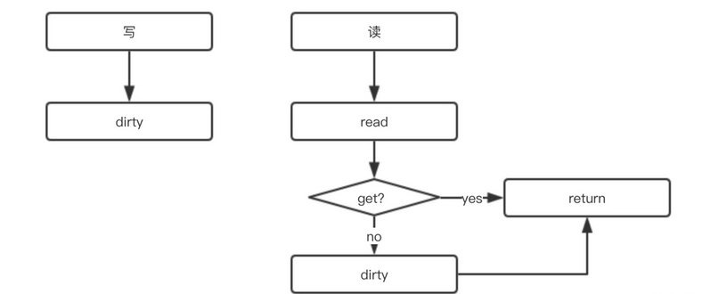
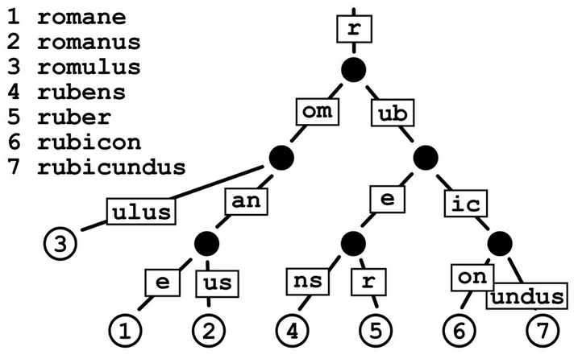
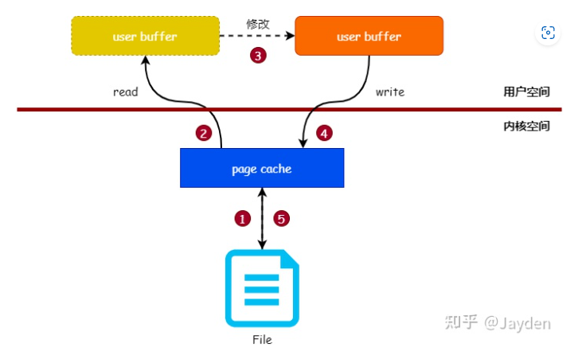

# Go-Problem
一些Go的相关问题

## Go-sync.map
Go原生map不是并发安全的， 要保证map的并发安全需要加锁， 然而这个锁是粗粒度的，消耗性能

解决思路：1.空间换时间， 2.降低锁的影响范围

sync.map: 采用读写分离的策略， 添加缓存read，原始数据存在dirty， 降低锁时间来提高效率； 缺点：不适用于大量写的场景，这样会导致read map读不到数据而进一步加锁读取，同时dirty map也会一直晋升为read map，整体性能较差。 适用场景：大量读，少量写
写操作：直接写入dirty， 读：先读read， read没有再读dirty


### 数据结构
```go
type Map struct {
	mu Mutex // 保护dirty字段
	read atomic.Value // readOnly相当于缓存
	dirty map[interface{}]*entry //包含最新写入的数据。当misses计数达到一定值，将其赋值给read。
	misses int //技术每次从read读取失败， 计数加一
}
```
### 查询
先去read中读， read中不存在就去dirty中读， 此时miss++， 如果miss>len(dirty)，将dirty赋值给read，将dirty置为nil
- 直接赋值是因为写操作只会操作dirty，所以保证了dirty是最新的，并且数据集是肯定包含read的
- 将diryt置为nil？？要是再经过写操作，dirty赋值给read，然后查询以前的数据那不是丢失了？？？--后面提到会将定期进行dirty的刷新

### 删
在read查找需要删除的元素， 找到将值标记为nil(标记删除)， 否则在dirty中查找， 找到直接删除
- 为什么dirty是直接删除，而read是标记删除？-- read的作用是在dirty前头优先度，遇到相同元素的时候为了不穿透到dirty，所以采用标记的方式。
- 直接删除的成本低， 不需要查找

### 增-改
先取读read， 如果read存在且未被标记为删除， 则尝试更新数据。若read存在，entry被标记expunge，则表明dirty没有key，可添加入dirty，并更新entry
若dirty有key则直接更新。若dirty和read都没有该key， 将该值加入到dirty当中。（源码还有一次判断， 如果此时read和dirty相同， 触发dirty刷新将read中未删除的数据赋值给dirty）


## Gin框架 路由前缀树
### Trie tree
Trie Tree的原理是将每个key拆分成每个单位长度字符，然后对应到每个分支上，分支所在的节点对应为从根节点到当前节点的拼接出的key的值。它的结构图如下所示。
每条边只存储一个字符。当存储的key带有大量重复的前缀时可以节省大量空间。

查询效率：每次从树根查找， 查询效率为O（m）， 随这key的长度增加， 时间越长， 本质原因时因为树的深度。


### Radix Tree
Radix Tree的计数统计原理和Trie Tree极为相似，一个最大的区别点在于它不是按照每个字符长度做节点拆分，而是可以以1个或多个字符叠加作为一个分支。这就避免了长字符key会分出深度很深的节点。Radix Tree的结构构造如下图所示：
本质就是减少树的深度


## COW无锁的读写并发
就是平时查询的时候，都不需要加锁，随便访问，只有在更新的时候，才会从原来的数据复制一个副本出来，然后修改这个副本，
最后把原数据替换成当前的副本。修改操作的同时，读操作不会被阻塞，而是继续读取旧的数据。这点要跟读写锁区分一下

读写锁：遵循写写互斥、读写互斥、读读不互斥的原则， COW则是写写互斥、读写不互斥、读读不互斥的原则。

优缺点
- 对于一些读多写少的数据，写入时复制的做法就很不错
- 数据一致性问题。这种实现只是保证数据的最终一致性，不能保证数据的实时一致性；在添加到拷贝数据而还没进行替换的时候，读到的仍然是旧数据


## mmap零拷贝技术
常规文件操作为了提高读写效率和保护磁盘，使用了页缓存机制。这样造成读文件时需要先将文件页从磁盘拷贝到页缓存中，由于页缓存处在内核空间，
不能被用户进程直接寻址，所以还需要将页缓存中数据页再次拷贝到内存对应的用户空间中。这样，通过了两次数据拷贝过程，才能完成进程对文件内容的获取任务。写操作也是一样


而使用mmap操作文件中，创建新的虚拟内存区域和建立文件磁盘地址和虚拟内存区域映射这两步，没有任何文件拷贝操作。而之后访问数据时发现内存中并无数据而发起的缺页异常过程，
可以通过已经建立好的映射关系，只使用一次数据拷贝，就从磁盘中将数据传入内存的用户空间中，供进程使用


优缺点
- 对文件的读取操作跨过了页缓存，减少了数据的拷贝次数，用内存读写取代I/O读写，提高了文件读取效率
- mmap的关键点是实现了用户空间和内核空间的数据直接交互而省去了空间不同数据不通的繁琐过程
- 适合读多写少的场景